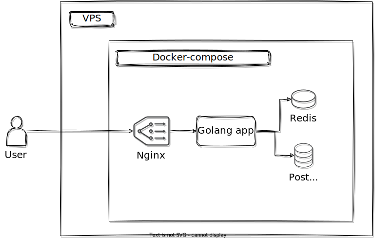

# description

SPA CI/CD app

# status

abandoned

there are too many great OSS CI/CD tools out there to make another,
especially if there is nothing original in this one

## overview



## structure

clean architecture


```
tianyi
├── api [Interface Adapters]
│   ├── controller
│   ├── middleware
│   └── presenter
├── cmd (CLI interface)
├── docs (OpenAPI Specification and other documentation)
│   └── diagrams
├── entity [Enterprise Business Rules]
├── infrastructure [Frameworks and Drivers]
│   ├── access
│   ├── branch
│   ├── config
│   ├── job
│   ├── jwt
│   ├── lifecycle
│   ├── pipeline
│   ├── pool
│   ├── project
│   ├── schedule
│   ├── session
│   └── user
├── pkg (Support packages)
│   └── error
└── usecase [Application Business Rules]
│   ├── access
│   ├── branch
│   ├── job
│   ├── jwt
│   ├── lifecycle
│   ├── pipeline
│   ├── pool
│   ├── project
│   ├── schedule
│   ├── session
│   └── user
└── web (Web interface)
```

## logo


they are made with [`google-font-to-svg-path`](https://danmarshall.github.io/google-font-to-svg-path/)
using font
[`zen-maru-gothic`](https://fonts.adobe.com/fonts/zen-maru-gothic#licensing-section)

## frontend

[`vuejs`](https://vuejs.org/) SPA with
[`primevue`](https://www.primefaces.org/primevue/)

### theme

modified [`sakai-vue`](https://github.com/primefaces/sakai-vue) theme
with pieces from
[primevue official website](https://github.com/primefaces/primevue)

[`sakai-vue` demo](https://www.primefaces.org/sakai-vue/)

## backend

[`golang`](https://go.dev/) with
[`fiber`](https://docs.gofiber.io/)

### database

[`gorm`](https://gorm.io/) is used as a driver, so any of
[these databases](https://gorm.io/docs/connecting_to_the_database.html)
can be used

only `postgresql` is configured

#### passwords

passwords are hashed with [Argon2id](https://cheatsheetseries.owasp.org/cheatsheets/Password_Storage_Cheat_Sheet.html#argon2id),
as suggested in
[Password Storage Cheat Sheet](https://cheatsheetseries.owasp.org/cheatsheets/Password_Storage_Cheat_Sheet.html)

## resources

- architecture

  - https://gitlab.com/redhatdemocentral/portfolio-architecture-examples
    https://redhatdemocentral.gitlab.io/portfolio-architecture-tooling/index.html?#/portfolio-architecture-examples/projects/retail-data-framework.drawio
  - https://medium.com/wesionary-team/a-clean-architecture-for-web-application-in-go-lang-4b802dd130bb
  - https://8thlight.com/blog/uncle-bob/2012/08/13/the-clean-architecture.html
  - https://eltonminetto.dev/en/post/2020-07-06-clean-architecture-2years-later/
  - https://manakuro.medium.com/clean-architecture-with-go-bce409427d31
  - https://github.com/eminetto/clean-architecture-go
  - https://eltonminetto.dev/en/post/2018-03-05-clean-architecture-using-go/
  - https://blog.cleancoder.com/uncle-bob/2012/08/13/the-clean-architecture.html
  - https://proandroiddev.com/why-you-need-use-cases-interactors-142e8a6fe576
  - https://itnext.io/golang-and-clean-architecture-19ae9aae5683
  - https://hackernoon.com/golang-clean-archithecture-efd6d7c43047

- golang

  - https://www.rudderstack.com/blog/implementing-graceful-shutdown-in-go
  - https://github.com/gofiber/recipes
  - https://ldej.nl/post/generating-swagger-docs-from-go/
  - https://github.com/hashicorp/hcl
  - https://github.com/gothinkster/golang-gin-realworld-example-app
  - https://github.com/alpody/golang-fiber-realworld-example-app
  - https://dev.to/aryaprakasa/serving-single-page-application-in-a-single-binary-file-with-go-12ij
  - https://codesahara.com/blog/golang-job-queue-with-redis-streams/
  - https://gorm.io/
  - https://docs.gofiber.io/
  - https://github.com/thomasvvugt/fiber-boilerplate
  - https://github.com/ansible-semaphore/semaphore
  - https://github.com/spf13/cobra
  - https://github.com/spf13/viper

- security

  - https://cheatsheetseries.owasp.org/cheatsheets/
  - https://www.alexedwards.net/blog/how-to-hash-and-verify-passwords-with-argon2-in-go

- frontend

  - https://github.com/primefaces/sakai-vue
  - https://github.com/primefaces/primevue
